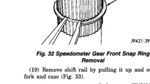
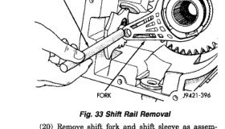
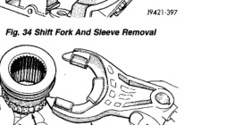

## TRANSMISSION AND TRANSFER CASE 21 - 399

### DISASSEMBLY AND ASSEMBLY (Continued)

(17) Remove speedometer gear from mainshaft (Fig. 31).

*Fig. 32 Speedometer Gear Removal]*
- SPEEDOMETER GEAR

(18) Remove speedometer gear front snap ring from mainshaft (Fig. 32).

*Fig. 33 Speedometer Gear Front Snap Ring Removal]*
- SPEEDOMETER FRONT RETAINING RING

(19) Remove shift rail by pulling it up and out of fork and case (Fig. 33).

*Fig. 34 Shift Rail Removal]*
- SHIFT RAIL
- FORK

(20) Remove shift fork and shift sleeve as assembly (Fig. 34).

[Figure: Fig. 34 Shift Fork And Sleeve Removal]
- SHIFT FORK AND SLEEVE

(21) Separate shift fork and sleeve (Fig. 35). Note position of sleeve for installation reference.

[Figure: Fig. 35 Separating Shift Fork And Sleeve]
- SHIFT SLEEVE
- SHIFT FORK

(22) Roll case on side and off wood blocks.

(23) Tap input gear out of bearing with plastic mallet (Fig. 36).

[Figure: Fig. 36 Starting Input Gear Out of Bearing]
- INPUT GEAR
- PLASTIC MALLET