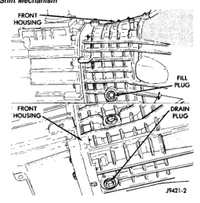
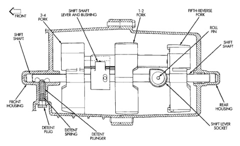

# GENERAL INFORMATION (Continued)

*Fig. 2 NV3500 Shift Mechanism]*
- SHIFT SHAFT
- REAR FORK
- SHIFT SHAFT LEVER AND BUSHINGS
- 1-2 FORK
- FIFTH REVERSE FORK
- ROLL PIN
- SHIFT LEVER
- FRONT HOUSING
- DETENT PLUG
- DETENT SPRING
- DETENT PLUNGER
- SHIFT LEVER SOCKET
- REAR HOUSING

## DRAIN AND FILL PLUG LOCATIONS

The NV3500 fill and drain plugs are both located in the front housing. The fill plug is at the passenger side of the housing. The drain plug is at the bottom of the housing (Fig. 3).

*Fig. 3 Drain and Fill Plug Locations]*
- FRONT HOUSING
- FILL PLUG
- FRONT HOUSING
- DRAIN PLUG

## TRANSMISSION GEAR RATIOS

Two versions of the NV3500 are available. The wide ratio version has a 4.01 first gear and 2.32 second gear. The close ratio NV3500 has a 3.49 first gear and 2.16 second gear.

# DIAGNOSIS AND TESTING

## LOW LUBRICANT LEVEL

A low transmission lubricant level is generally the result of a leak, inadequate lubricant fill, or an incorrect lubricant level check.

Leaks can occur at the mating surfaces of the housings, or from the front/rear seals. A suspected leak could also be the result of an overfill condition. Leaks at component mating surfaces will probably be the result of inadequate sealer, gaps in the sealer, incorrect bolt tightening, or use of a non-recommended sealer.

A leak at the front of the transmission will be from either a loose or damaged, front bearing retainer or retainer seal. Lubricant may also drip from the transmission clutch housing after extended operation. If the leak is severe, it will contaminate the clutch disc causing slip, grab and chatter.