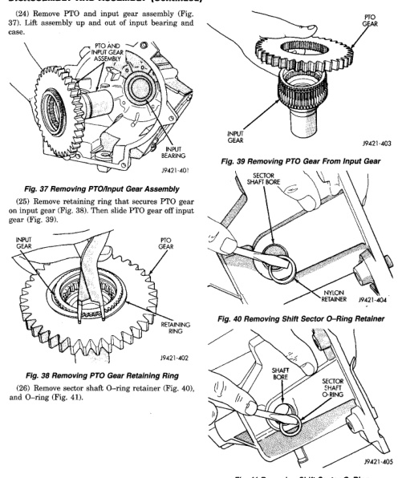

## 21 - 400 TRANSMISSION AND TRANSFER CASE

### DISASSEMBLY AND ASSEMBLY (Continued)

(24) Remove PTO and input gear assembly (Fig. 37). Lift assembly up and out of input bearing and case.

*Fig. 38 Removing PTO/Input Gear Assembly]*
- PTO AND INPUT GEAR ASSEMBLY
- INPUT BEARING

(25) Remove retaining ring that secures PTO gear on input gear (Fig. 38). Then slide PTO gear off input gear (Fig. 39).

[Figure: Fig. 38 Removing PTO Gear Retaining Ring]
- INPUT GEAR
- PTO GEAR
- RETAINING RING

[Figure: Fig. 39 Removing PTO Gear From Input Gear]
- PTO GEAR
- INPUT GEAR

(26) Remove sector shaft O-ring retainer (Fig. 40), and O-ring (Fig. 41).

[Figure: Fig. 40 Removing Shift Sector O-Ring Retainer]
- SECTOR SHAFT BORE
- NYLON RETAINER
- BOOT

[Figure: Fig. 41 Removing Shift Sector O-Ring]
- BOOT
- SECTOR SHAFT O-RING