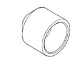
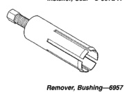
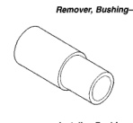
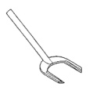

*Fig. 2*

TORQUE

Description Torque

Clutch Housing Bolts . . . . . . . . . . 54-61 Nom (40-45 ft. lbs.) Crossmember-To-Frame Bolts . . . 61-75 Nem (44-55 ft. Ibs.) Crossmember-To-Insulator Nuts . . 54-61 Nom (40-45 ft. Ibs.) Drain/Fill Plug . Front-To-Rear Housing Bolts . . . . 30-35 Nem (22-26 ft. lbs.) Front Bearing Ratainer Bolts . . . . . . 7-10 Nom (5-7 ft. Ibs.) Idler Shaft Bolts Rear Bearing Retainer Bolts . . . . 30-35 Nem (22-26 ft. ibs.) Shift Tower Bolts Slove Cylinder Attaching Nuts . . . . . . . 23 Nem (200 in. Ibs.) Transfer Case Attaching Nuts . U-Joint Clamp Bolts . . . . . . . . . . . . . . 19 N .m (170 in. Ibs.) J9421-212

NV3500 MANUAL TRANSMISSION

*Fig. 3*

*Remover, Seal-C-3985-B*

*Fig. 4*

*Installer, Seal-C-3972-A*

*Fig. 5*

*Remover, Bushing-6957*

[Figure]

*Installer, Bushing-6951*
