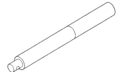
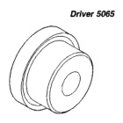
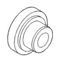
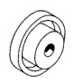

## 21 - 410 TRANSMISSION AND TRANSFER CASE — BR

### SPECIAL TOOLS

#### NV 021 ADAPTER

*Fig. 1 Handle C-4171 - Long cylindrical handle tool*

*Fig. 2 Driver 5065 - Circular driver tool with center hole*

*Fig. 3 Driver 7828 - Circular driver tool with center hole*

*Fig. 4 Driver C-4210 - Circular driver tool with center hole*

*Fig. 5 Driver 5062 - Circular driver tool with center hole*