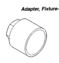
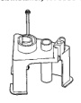
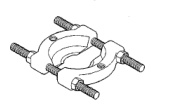
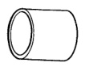

SPECIAL TOOLS (Continued)

*Fig. 5*

*Fig. 6*

Remover/Installer, NV3500 Shift Rail Roll Pin—6858

*Fig. 7*

Fixture, NV3500-6747

*Fig. 8*

Adapter, Fixture-6747-1A

[Figure]

[Figure]

*Cup, Fixture-8115*

[Figure]

Splitter, Bearing-1130

[Figure]

*Tube-6310-1*
