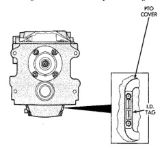
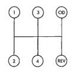
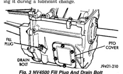

The NV4500 transmission identification tag is attached to the driver side PTO cover (Fig. 2). The tag provides the transmission model number, build date and part number. Be sure to reinstall the I.D. tag if removed during service. The information on the tag is essential to correct parts ordering.

*Fig. 2*

Required lubricant for the NV4500 is Mopar Manual Transmission Lubricant, P/N 4637579. This is the only lubricant recommended for use. Dry fill lubricant capacity is approximately 3.78 liters (8 pints). Correct lubricant fill level is to the bottom edge of the fill plug hole (Fig. 3). Check fill level only when the transmission is level. The transmission lubricant is drained through the PTO cover bottom bolt hole (Fig. 3). It will be necessary to apply sealer to the bolt threads before installing it during a lubricant change.

*Fig. 3 NV4500 Fill Plug And Drain Bolt*

RATIO RANGE First gear 5.61:1 Second Gear 3.04:1 Third Gear 1.67:1 1.00:1 Fourth Gear Fifth Gear 0.75:1 5.04:1 Reverse gear

The NV4500 shift pattern is in a modified H pattern (Fig. 4). Overdrive fifth and reverse gears are in line and outboard of the first through fourth gear positions.

*Fig. 4*

19221-13

The majority of transmission malfunctions are a result of:

• · insufficient lubricant. · incorrect lubricant. · misassembled or damaged internal components. · improper operation.

A low lubricant level, loose or worn shift lever, or loose, damaged shift housing components are common causes of hard shifting. If hard shifting is also accompanied by gear clash, synchronizer clutch and stop rings, or mainshaft gear teeth may be worn or damaged. Hard shifting may also be caused by a loose, or misaligned shift cover, or alignment dowels. Worn, or damaged shift cover components will also cause hard shifting. Any of the foregoing faults will cause component bind and high shift efforts. Misassembled synchro components will also cause shift problems. Incorrectly installed synchro sleeves, struts, or springs will all cause shift problems.
