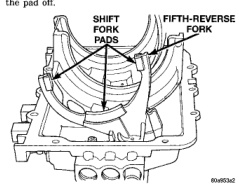
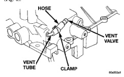

Transmission noise is most often a result of worn or damaged components. Chipped, broken gear or synchronizer teeth and brinnelled, spalled bearings all cause noise. Abnormal wear and damage to internal components is frequently the end result of insufficient lubricant, non-recommended lubricants, or improper operation.

Transmission disengagement may be caused by misaligned or damaged shift components, or worn teeth on the mainshaft gears or synchro components. Incorrect assembly will also contribute to gear disengagement.

Insufficient transmission lubricant is usually the result of leaks, or inaccurate fluid level check or refill Inethod. Leaks will be evident by the presence of gear oil around the leak point. If leakage is not evident, the condition is probably the result of an under fill condition. If air powered lubrication equipment is used to fill a transmission, be sure the equipment is properly calibrated. Equipment out of calibration can lead to an underfill condition.

Worn, damaged, or misaligned clutch components can cause difficult shifting, gear clash and noise. A damaged pilot bearing will cause noise. If bearing damage is severe, drive gear misalignment and hard shifting can also occur. A worn or damaged clutch disc, pressure plate, or release bearing can cause hard shifting and gear clash. Damaged or worn clutch hydraulic components, or leaks in the fluid lines or cylinders will cause hard shifting and gear clash. Failure of one of the clutch hydraulic cylinders can result in incomplete clutch release or engagement. Verify that clutch components are all in good condition before removing the transmission for repair.

The plastic shift fork pads are held in place by a combination of tension and a small locating tang. Three pads are used on the fork (Fig. 5). The pads can be removed either by hand or with a narrow blade screwdriver. To remove the pads by hand, grasp each pad and tilt it out and off the fork.

If the pads prove difficult to remove by hand, insert a screwdriver blade between the pad and fork and pry the pad off.

*Fig. 5*

*Flg. 5 Shift Fork Pad Locations*

The shift cover vent assembly consists of the vent tube, connecting hose, hose clamps, and vent valve (Fig. 6).

*Fig. 6*

If the vent tube is removed for replacement or service access, apply Mopar® silicone adhesive/sealer, or equivalent, to the tube to help secure it in the cover. Ensure that the vent is positioned 15-35° from horizontal in order to prevent leaks.

The backup light switch is located at the left (driver) side of the cover (Fig. 7). The switch plunger is operated by the fifth-reverse shift rail. The switch can be replaced with the transmission in, or out of the vehicle. A gasket must used with the switch. Apply sealer to the switch threads before installation. Tightening torque for the switch is 22-34 N-m (192-300 in. lbs.).
