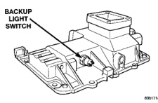
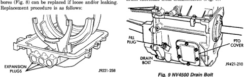

*Fig. 8*

The expansion plugs at the rear of the shift rail bores (Fig. 8) can be replaced if loose and/or leaking. Replacement procedure is as follows:

(1) Drill 6 mm (1/4 in.) diameter hole in center of each plug to be removed. (2) Pry plug out of cover with tapered punch. (3) Clean all chips from shift cover and plug bores. Then clean plug bores with solvent and dry with clean shop towel. (4) Apply small bead of sealer to outer edge of each new plug. Use Mopar® silicone adhesive/sealer, or equivalent. (5) Position each new plug in bore and tap into place with hammer and suitable size punch or socket.

(1) Disconnect battery negative cable. (2) Shift transmission into Neutral. (3) Remove screws attaching shift boot to floornan. Then slide boot upward on the shift lever. (4) Remove the bolts holding the shift tower to the isolator plate and transmission shift cover,

(5) Remove the shift tower and isolator plate from the transmission shift cover. (6) Raise and support vehicle. (7) Mark propeller shaft and axle yokes for alignment reference. Use paint, scriber, or chalk to mark vokes. (8) Remove universal joint strap screws and remove straps. (9) Remove propeller shaft. (10) Disconnect and remove exhaust system Y-pipe. (11) Disconnect wires at speed sensor and backup light switch. (12) Support engine with adjustable safety stand and wood block. (13) If transmission is to be disassembled for repair, remove drain bolt at bottom of PTO cover and drain lubricant from transmission (Fig. 9).

(14) Remove bolts nuts attaching transmission to rear mount. (15) Support transmission with a transmission jack. Secure transmission to jack with safety chains. (16) Remove rear crossmember. (17) Remove bolts attaching clutch slave cvlinder to clutch housing. Then move cylinder aside for working clearance. (18) Remove transmission harness wires from clips on transmission shift cover. (19) Remove bolts attaching transmission to clutch housing. (20) Slide transmission and jack rearward until input shaft clears clutch housing. (21) Lower transmission jack and remove transmission from under vehicle.

(1) Apply light coat of Mopar® high temperature bearing grease to contact surfaces of following components: · input shaft splines and pilot bearing hub.

• · release bearing slide surface of front retainer. · pilot bearing. · release bearing bore. · release fork.

*Fig. 9*
