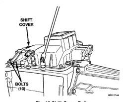
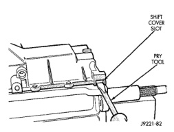

0000

(1) Shift transmission into Neutral. (2) Unscrew and remove the shift lever extension from the shift (3) Remove screws attaching shift boot to floorpan. Then slide boot upward on the shift lever. (4) Remove the bolts holding the shift tower to the isolator plate and transmission shift cover. (5) Remove the shift tower and isolator plate from the transmission shift cover.

(1) Clean the mating surfaces of shift tower, isolator plate, and shift cover with suitable wax and grease remover. (2) Apply Mopar® Gasket Maker, or equivalent, to the sealing surface of the shift cover. Do not over apply sealant. (3) Install the isolator plate onto the shift cover, metal side down. (4) Install the shift tower onto the isolator plate. No sealant is necessary between the shift tower and the isolator plate. (5) Verify that the shift tower, isolator plate, and the shift tower bushings are properly aligned. (6) Install the bolts to hold the shift tower to the isolator plate and the shift cover. Tighten the shift tower bolts to 10.2-11.25 N.m (7.5-8.3 ft. Ibs.). (7) Install the shift lever extension, shift boot, and bezel.

(1) Remove transmission from vehicle. (2) Remove shift cover bolts (Fig. 12). (3) Loosen shift cover with pry tool. To avoid damaging cover seal surface, insert pry tool only in slots provided in cover (Fig. 13). (4) Raise cover enough to disengage it from alignment dowels in gear case (Fig. 14). (5) Raise front of shift cover and lift cover up and off gear case (Fig. 14).

(1) Clean mating surfaces of shift cover and gear case with wax and grease remover. (2) Apply Mopar® Gasket Maker, or equivalent, to sealing surface of shift cover or gear case. Do not over-apply sealer material. Excess can be squeezed into gear case and could block lubricant feed holes in time. (3) Lubricate synchro sleeves with Castrol Syntorq gear lubricant. Then apply light coat of petroleum jelly to shift fork contact surfaces.

*Fig. 12 Shift Cover Bolts*

*Fig. 13*

(4) Verify that the shift fork pads (Fig. 15) are properly and securely positioned on the fifth-reverse for is (5) Verify that 1-2 and 3-4 synchro sleeves are in neutral position. Also verify that forks in shift cover are in neutral position. (6) Align and install shift cover (Fig. 14). If cover will not seat, it is either not aligned on gear case dowels, or shift forks are not aligned with sleeves and shift lug. (7) Apply Mopar® Lock N' Seal, or equivalent, to threads of shift cover bolts. (8) Install and tighten shift cover bolts to 27-31 N.m (216-276 in. Ibs.) torque. (9) Install backup lamp switch and gasket in cover. Apply sealer to switch threads before installation and tighten switch to 22-34 N-m (193-265 in. lbs.). (10) Install vent assembly, if removed. Apply an adhesive/sealer to vent tube to help secure it in cover.
