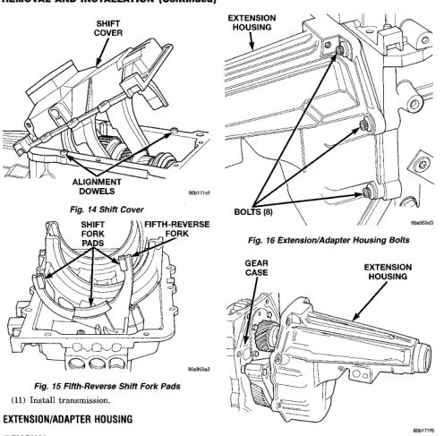

*Fig. 16*

(1) Raise and support vehicle. (2) Remove rear propeller shaft. (3) Support transmission with suitable transmission jack. (4) Remove engine rear support. Refer to Group 9, Engine, for proper procedures. (5) Remove transfer case, if equipped. (6) Remove bolts attaching extension/adapter housing to gear case (Fig. 16). (7) Remove extension/adapter housing (Fig. 17). There is one alignment dowel in the gear case and one in the extension/adapter housing. (8) Remove rubber spline seal from end of mainshaft (Fig. 18). The seal can be reused or discarded

*Fig. 16 Extension/Adapter Housing Bolts*

as desired. The seal is not an essential part and can be reused or discarded as desired. The seal is mainly used to prevent lubricant loss during shipping and does not have to be replaced if damaged.

(1) Clean mating surfaces of extension/adapter housing and gear case with a wax and grease remover. (2) Check alignment dowels in gear case and housing or adapter. Be sure dowels are in position and seated.
