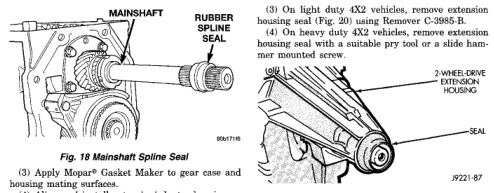
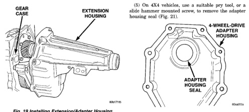

*Fig. 19*

(3) Apply Mopar® Gasket Maker to gear case and housing mating surfaces (4) Align and install extension/adapter housing on gear case (Fig. 19).

(5) Apply Mopar® Lock N' Seal, or equivalent, to threads of extension/adapter housing bolts. (6) Install and tighten housing bolts to 54 N.m (40 ft. Ibs.) torque. (7) Install transfer case, if equipped. (8) Install engine rear support. Refer to Group 9, Engine, for proper procedures. (9) Install propeller shaft(s). (10) Remove transmission support stand and lower vehicle.

(1) On 4X2 vehicles, remove the propeller shaft. (2) On 4X4 vehicles, remove the transfer case.

*Fig. 20 Extension Housing And Seal (2-Wheel Drive*

(6) On light duty transmissions, remove the extension housing bushing with Remover 6957. (7) On heavy duty transmissions, remove the extension housing bushing with Remover 8155.

(1) On light dutv transmissions, install the extension housing bushing with Installer 6951 and Handle C-4171 (Fig. 22). (2) On heavy duty transmissions, install the extension housing bushing with Installer 8156 and Handle C-4171. (3) On light dutv 4X2 transmissions, install the extension housing seal with Installer C-3972-A and Handle C-4171 (Fig. 23).

*Fig. 20*
