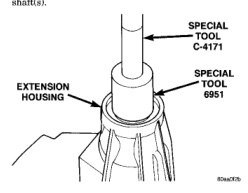
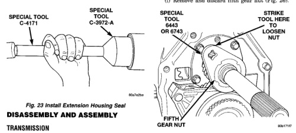

(4) On heavy duty 4X2 transmissions, install the extension housing seal with Installer 8154 and Handle C-4171. (5) On 4X4 transmissions, install the adapter housing seal with Installer C-3860-A and Handle C-4171 (6) Install transfer case, if necessary, and propeller shaft(s).

*Fig. 22 Install Extension Housing Bushing*

(1) Remove mainshaft fifth gear nut as follows: (a) Install nut wrench on fifth gear nut (Fig. 24). Use Nut Wrench 6443 on standard duty models and Wrench 6743 on heavy duty models.

(b) Note that wrench only fits one way on nut. Be sure wrench is fully engaged in nut slots and is not cocked. (c) There are four splined sockets available to retain the mainshaft while removing the fifth gear nut.

• · Socket 6441 fits light duty 4X2 mainshafts. · Socket 6442 fits light duty 4X4 mainshafts. · Socket 6993 fits heavy dutv 4X2 mainshafts. · Socket 6984 fits heavy duty 4X4 mainshafts.

(d) Install breaker bar in appropriate socket wrench (Fig. 25). (e) Wedge breaker bar handle against workbench. Purpose of socket wrench and breaker bar is to prevent mainshaft from turning while nut is loosened. (f) Position small end of Nut Wrench 6443 at approximately 10 o'clock position (Fig. 24). (g) Strike small end of nut wrench with heavy copper hammer to break nut loose. Nut is secured by interference fit thread plus Loctite adhesive and will require several firm blows to loosen it (nut torque is in 300 ft. lb. range). (h) Once nut is loose, it can be removed by holding nut wrench with breaker bar and rotating output shaft with socket wrench and ratchet. (i) Remove and discard fifth gear nut (Fig. 26).

*Fig. 24 Installing Nut Wrench On Mainshaft Fifth Gear*

*Fig. 24*
