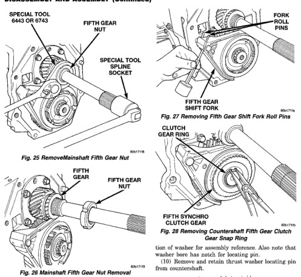
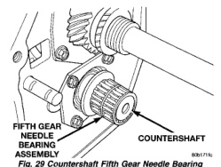

# TRANSMISSION AND TRANSFER CASE 21-55

## DISASSEMBLY AND ASSEMBLY (Continued)

*Fig. 25 Removing Mainshaft Fifth Gear Nut]*
- SPECIAL TOOL 6443-6743
- FIFTH GEAR NUT
- SPECIAL TOOL SPLINE SOCKET

*Fig. 27 Mainshaft Fifth Gear Nut Removal]*
- FIFTH GEAR
- FIFTH GEAR NUT

[Figure: Fig. 27 Removing Fifth Gear Shift Fork Roll Pins]
- FORK ROLL PINS
- FIFTH GEAR SHIFT FORK

[Figure: Fig. 28 Removing Countershaft Fifth Gear Clutch Gear Snap Ring]
- CLUTCH GEAR RING
- FIFTH SYNCHRO CLUTCH GEAR

(2) Remove roll pins that secure countershaft fifth gear shift fork to shift rail with pin punch (Fig. 27). Roll pins are driven out from bottom of fork and not from top.

(3) Remove snap ring that secures fifth gear clutch hub and gear on countershaft (Fig. 28).

(4) Remove fifth gear shift fork and gear assembly. Remove assembly by tapping fork off rail with plastic mallet.

(5) Remove countershaft fifth gear clutch gear and stop ring.

(6) Remove fifth gear shift fork from sleeve.

(7) Remove sleeve, struts, and strut springs from countershaft fifth gear hub, if necessary.

(8) Remove countershaft fifth gear needle bearing assembly (Fig. 29).

(9) Remove cone shaped rear bearing thrust washer from end of countershaft (Fig. 30). Note position of washer for assembly reference. Also note that washer bore has notch for locating pin.

(10) Remove and retain thrust washer locating pin from countershaft.

[Figure: Fig. 29 Countershaft Fifth Gear Needle Bearing Removal]
- FIFTH GEAR NEEDLE BEARING ASSEMBLY
- COUNTERSHAFT