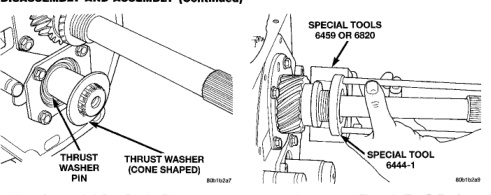
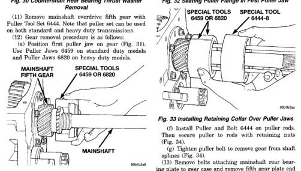

# 21-56 TRANSMISSION AND TRANSFER CASE

## DISASSEMBLY AND ASSEMBLY (Continued)

*Fig. 32 Countershaft Rear Bearing Thrust Washer Removal]*
- THRUST WASHER
- THRUST WASHER (CONE SHAPED)

(11) Remove mainshaft overdrive fifth gear with brake. Two different fifth gear brakes are to be used on both standard and heavy duty transmissions.

(12) Gear removal procedure is as follows:

(a) Position first puller jaw on gear (Fig. 31).

*Fig. 33 Installing First Puller Jaw on Mainshaft Fifth Overdrive Gear]*
- MAINSHAFT
- FIFTH GEAR
- SPECIAL TOOLS 6459 OR 6820
- MAINSHAFT

(b) Assemble Puller Flange 6444-1 and Puller Rods 6444-3 for 4X2 vehicles, or 6444-4 for 4X4 vehicles, (Fig. 32).

(c) Slide assembled puller flange and rods onto output shaft. Then seat flange in notch of puller jaw (Fig. 32).

(d) Position second puller jaw (6459 or 6820) on gear and in notch of puller flange (Fig. 33).

(e) Slide Retaining Collar 6444-8 over puller jaws to hold them in place (Fig. 33).

[Figure: Fig. 32 Seating Puller Flange in First Puller Jaw]
- SPECIAL TOOLS 6459 OR 6820
- SPECIAL TOOL 6444-1

[Figure: Fig. 33 Installing Retaining Collar Over Puller Jaws]
- SPECIAL TOOLS 6459 OR 6820
- SPECIAL TOOL 6444-8
- SPECIAL TOOL 6444-1

(f) Install Puller and Bolt 6444 on puller rods. Then secure puller to rods with retaining nuts (Fig. 34).

(g) Tighten puller bolt to remove gear from shaft splines (Fig. 34).

(13) Remove bolts attaching mainshaft rear bearing plate to gear case and remove fifth gear plate end play shims and bearing cup (Fig. 35).

### FRONT RETAINER REMOVAL

(1) Remove front retainer bolts (Fig. 36). Discard retainer bolts. They should not be reused.

(2) Remove front retainer by lightly tapping it back and forth with plastic mallet to loosen it. Then rock retainer back and forth by hand to work it out of gear case. Note that retainer flange extends into the transmission case and is a snug fit into case bore.

(3) Remove seal from front retainer (Fig. 37). Use small chisel to collapse one side of seal then pry it out with suitable tool.

(4) Remove bearing cup from front retainer as follows: