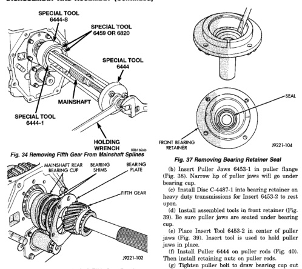
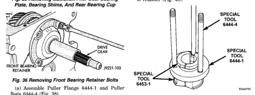

*Fig. 35 Removing Mainshaft Fifth Gear Bearing Plate, Bearing Shims, And Rear Bearing Cup*

(a) Assemble Puller Flange 6444-1 and Puller Rods 6444-4 (Fig. 38).

(d) Install assembled tools in front retainer (Fig. 39). Be sure puller jaws are seated under bearing cup. (e) Place Insert Tool 6453-2 in center of puller jaws (Fig. 39). Insert tool is used to hold puller jaws in place. (f) Install Puller 6444 on puller rods (Fig. 40). Then install retaining nuts on puller rods. (g) Tighten puller bolt to draw bearing cup out of retainer (Fig. 40).

*Fig. 38 Assembling Puller Rods, Flange And Jaws*

*Fig. 38*
