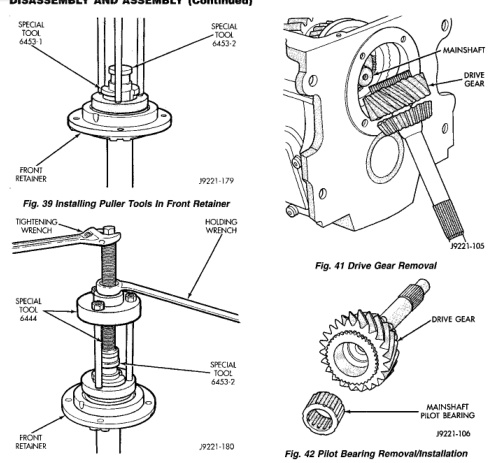

*Fig. 41*

(1) Remove drive gear (Fig. 41). (2) Remove pilot bearing from drive gear (Fig. 42). (3) Remove tapered bearing from drive gear as follows: (a) Assemble Puller Flange 6444-1 and Puller Rods 6444-6. Then position first Puller Jaw 6447 on bearing (Fig. 43). (b) Slide assembled puller flange and rod tools onto input shaft. Then seat flange in notch of puller jaw (Fig. 43). (c) Position second Puller Jaw 6447 on gear and in notch of puller flange (Fig. 43). (d) Slide Retaining Collar 6444-8 over puller jaws to hold them in place (Fig. 43).

*Fig. 41 Drive Gear Removal*

(e) Install Puller 6444 on puller rods. Then secure puller to rods with retaining nuts (Fig. 43). (f) Tighten puller bolt to remove bearing cone from drive gear (Fig. 43).

(1) Move 1-2 and 3-4 synchro sleeves into Neutral, if necessary. (2) Remove drive gear thrust bearing from forward end of mainshaft (Fig. 44). (3) Remove fourth gear clutch gear and synchro stop ring from mainshaft (Fig. 45). (4) Roll gear case onto left side (Fig. 46). (5) Remove rear mainshaft rear bearing. (6) Remove mainshaft assembly as follows (Fig. 46):
