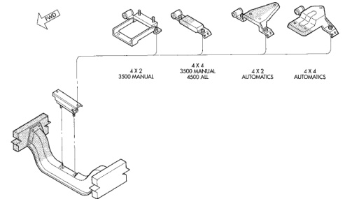

# TRANSMISSION AND TRANSFER CASE 21-5

## REMOVAL AND INSTALLATION (Continued)

*Fig. 1 Transmission Rear Support Brackets]*
- 4 X 2 3500 MANUAL
- 4 X 4 3500 MANUAL 4500 ALL
- 4 X 2 AUTOMATICS
- 4 X 4 AUTOMATICS

(20) Move transmission rearward until input shaft is clear of clutch disc and cover. Then lower jack and remove transmission from under vehicle.

### INSTALLATION

(1) Make sure transmission front housing mounting surface is clean before installation.

(2) Apply light coat of Mopar® high temperature bearing grease to contact surfaces of following components:
- input shaft splines and pilot bearing hub.
- release bearing slide surface of front retainer.
- pilot bearing.
- release bearing bore.
- release fork.
- release ball stud.
- propeller shaft slip yoke.

(3) Mount transmission on jack. Secure transmission to jack with safety chains.

(4) Align transmission input shaft with clutch disc. Then slide transmission into place on engine block.

(5) Install and tighten transmission attaching bolts to 54-61 N·m (40-45 ft. lbs.) torque. Be sure front housing is fully seated before tightening bolts. Install front dust cover after all bolts are tightened.

(6) Fill transmission with Mopar® lubricant P/N 4761526. Correct fill level is to bottom edge of fill plug hole.

(7) Connect backup lamp switch wires.

(8) Connect transmission harnesses to clips on case.

(9) Install crossmember. Tighten crossmember-to-frame bolts to 68 N·m (50 ft. lbs.) torque.

(10) Tighten crossmember-to-transmission insulator nuts to 68 N·m (50 ft. lbs.) torque.

(11) Install slave cylinder. Tighten cylinder nuts to 23 N·m (200 in. lbs.) torque.

(12) Remove jack used to support transmission.

(13) Install strut bolts/nuts, if removed. Also install oil filter if removal was necessary.

(14) Install and connect exhaust system. Align exhaust components before tightening clamp and bracket bolts and nuts. Be sure exhaust components are clear of all chassis and driveline components.

(15) Align and install propeller shaft. Tighten U-joint clamp bolts to 19 N·m (170 in. lbs.) torque.

(16) Verify that all linkage components, hoses and electrical wires have been connected.

(17) Remove any remaining support stands and lower vehicle.

(18) Install crankshaft position sensor.

(19) Connect battery negative cable.

(20) Install shift tower and lever assembly. Tighten shift tower bolts to 7-10 N·m (5-7 ft. lbs.) torque.

(21) Install shift boot and bezel.