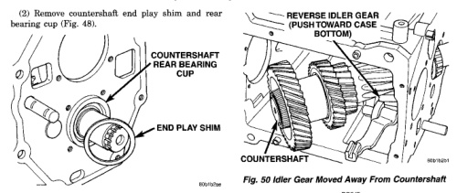
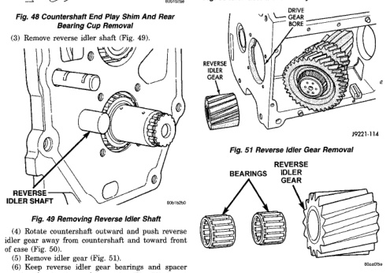

*Fig. 50*

### TRANSMISSION AND TRANSFER CASE -

(4) Rotate countershaft outward and push reverse idler gear away from countershaft and toward front of case (Fig. 50). (5) Remove idler gear (Fig. 51). (6) Keep reverse idler gear bearings and spacer together for cleaning and inspection (Fig. 52). Insert idler shaft through gear and bearings to keep them in place. (7) Remove idler gear thrust washers from gear case. Install washers on idler shaft to keep them together for cleaning and inspection.

*Fig. 51 Reverse Idler Gear Removal*

*Fig. 52 Reverse Idler Gear Components*

*Fig. 51*
