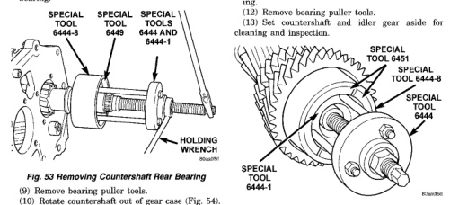

# TRANSMISSION AND TRANSFER CASE 21-61

## DISASSEMBLY AND ASSEMBLY (Continued)

(8) Remove countershaft rear bearing. Shaft cannot be removed from case until rear bearing has been removed. Bearing removal procedure is as follows:

(a) Assemble Puller Flange 6444-1 and Puller Rods 6444-4 (Fig. 53).

(b) Position first Puller Jaw 6449 on bearing cone (Fig. 53).

(c) Seat puller flange in notch of puller jaw just installed on bearing cone (Fig. 53).

(d) Install second Puller Jaw 6449 on bearing and in notch of puller flange (Fig. 53).

(e) Slide Retaining Collar 6444-8 over puller jaws to hold them in place (Fig. 53). Note that retaining collar has small lip on one end and only fits one way over jaws.

(f) Install Puller 6444 on puller rods. Then secure puller to rods with retaining nuts (Fig. 53).

(g) Tighten puller bolt to remove bearing from shaft (Fig. 53). If bearing is exceptionally tight, tap end of puller bolt with copper mallet to help loosen bearing.

*Fig. 53 Removing Countershaft Rear Bearing*

(9) Remove bearing puller tools.

(10) Rotate countershaft out of gear case (Fig. 54).

(11) Remove countershaft front bearing as follows:

(a) Assemble Puller Flange 6444-1 and Puller Bolts 6444-4 (Fig. 55).

(b) Position first Puller Jaw 6451 on bearing.

(c) Seat puller flange in notch of puller jaw.

(d) Install second Puller Jaw 6451 on bearing and in notch of puller flange.

(e) Slide Retaining Collar 6444-8 over puller jaws to hold them in place (Fig. 55). Note that retaining collar has small lip on one end and only fits one way over jaws.

(f) Install Puller Bridge And Bolt Assembly 6444 on puller bolts. Then secure bridge to bolts with retaining nuts (Fig. 55).

### COUNTERSHAFT

*Fig. 54 Removing Countershaft From Gear Case]*

(g) Tighten puller bolt to remove bearing from shaft (Fig. 55). If bearing is exceptionally tight, tap end of puller bolt with mallet to help loosen bearing.

(12) Remove puller tools.

(13) Set countershaft and idler gear aside for cleaning and inspection.

[Figure: Fig. 55 Removing Countershaft Front Bearing
- SPECIAL TOOL 6451
- SPECIAL TOOL 6444-8
- SPECIAL TOOL 6444
- SPECIAL TOOL 6444-1
- HOLDING WRENCH]

### GEAR CASE DISASSEMBLY

(1) Remove countershaft front bearing cap. Use mallet or hammer to remove cap from inside case (Fig. 56).

(2) Remove countershaft front bearing cup with Remover Tool 6454 and Tool Handle C-4171 (Fig. 57).

(3) Remove roll pin that secures shift lug on shift rail in case (Fig. 58). A small pin punch can be modified by putting a slight bend in it to drive pin completely out of shift rail (Fig. 58).

(4) Remove shift lug rail.