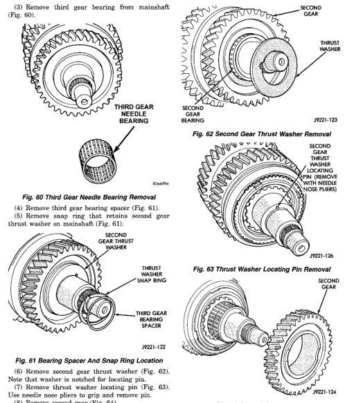

## TRANSMISSION AND TRANSFER CASE 21-63

### DISASSEMBLY AND ASSEMBLY (Continued)

(3) Remove third gear bearing from mainshaft (Fig. 60).

*Fig. 62 Third Gear Needle Bearing Removal]*
- Third gear needle bearing

(4) Remove third gear bearing spacer (Fig. 61).

(5) Remove snap ring that retains second gear thrust washer on mainshaft (Fig. 61).

[Figure: Fig. 61 Bearing Spacer And Snap Ring Location]
- Second gear thrust washer
- Thrust washer snap ring
- Third gear bearing spacer

(6) Remove second gear thrust washer (Fig. 62). Note that washer is notched for locating pin.

[Figure: Fig. 62 Second Gear Thrust Washer Removal]
- Second gear
- Thrust washer
- Second gear thrust washer (notched to fit over locating pin with needle nose pliers)

(7) Remove thrust washer locating pin (Fig. 63). Use needle nose pliers to grip and remove pin.

[Figure: Fig. 63 Thrust Washer Locating Pin Removal]
- Second gear
- Thrust washer locating pin
- Second gear bearing spacer

(8) Remove second gear (Fig. 64).

[Figure: Fig. 64 Second Gear Removal]
- Second gear