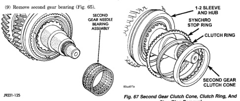
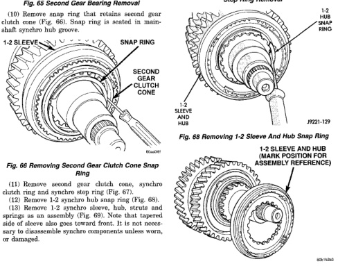

## 21-64 TRANSMISSION AND TRANSFER CASE

### DISASSEMBLY AND ASSEMBLY (Continued)

(9) Remove second gear bearing (Fig. 65).

*Fig. 66 Second Gear Bearing Removal]*
- Second gear needle bearing assembly

(10) Remove snap ring that retains second gear clutch cone (Fig. 66). Snap ring is seated in mainshaft spline hub groove.

*Fig. 67 Removing Second Gear Clutch Cone Snap Ring]*
- 1-2 sleeve
- Snap ring
- Second gear clutch cone
- 1-2 sleeve and hub

(11) Remove second gear clutch cone, synchro clutch ring and stop ring (Fig. 67).

[Figure: Fig. 67 Second Gear Clutch Cone, Clutch Ring, And Stop Ring Removal]
- 1-2 sleeve and hub
- Synchro stop ring
- Clutch ring
- Second gear clutch cone

(12) Remove 1-2 synchro hub snap ring (Fig. 68).

[Figure: Fig. 68 Removing 1-2 Sleeve And Hub Snap Ring]
- 1-2 snap ring
- 1-2 sleeve and hub

(13) Remove 1-2 synchro sleeve, hub, struts and springs as an assembly (Fig. 69). Note that tapered side of sleeve also goes toward front. It is not necessary to disassemble synchro components unless worn or damaged.

[Figure: Fig. 69 Removing 1-2 Synchro Sleeve And Hub]
- 1-2 sleeve and hub (mark position for assembly reference)