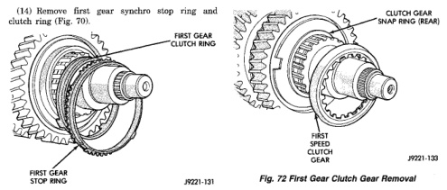
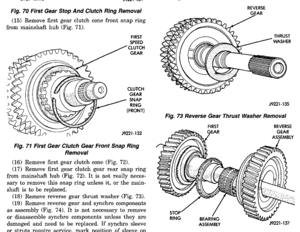

## DISASSEMBLY AND ASSEMBLY (Continued)

(14) Remove first gear synchro stop ring and clutch ring (Fig. 70).

*Fig. 73 First Gear Stop And Clutch Ring Removal]*
- FIRST GEAR STOP RING
- FIRST GEAR CLUTCH RING

(15) Remove first gear clutch cone front snap ring from mainshaft (Fig. 71).

*Fig. 74 First Gear Clutch Gear Front Snap Ring Removal]*
- FIRST SPEED CLUTCH GEAR
- CLUTCH GEAR SNAP RING (FRONT)

(16) Remove first gear clutch cone (Fig. 72).

(17) Remove first gear clutch gear rear snap ring from mainshaft (Fig. 72). It is not really necessary to remove this snap ring unless it, or the mainshaft is to be replaced.

(18) Remove reverse gear thrust washer (Fig. 73).

(19) Remove reverse gear and synchro components as assembly (Fig. 74). It is not necessary to remove or disassemble synchro components unless they are damaged and need to be replaced. If synchro sleeve or struts require service, mark position of sleeve on hub before removal. Correct sleeve position is important as sleeve can be installed backwards causing shift problems.

(20) Remove reverse gear bearing assembly from mainshaft (Fig. 74).

[Figure: Fig. 72 First Gear Clutch Gear Removal]
- CLUTCH GEAR SNAP RING (REAR)
- FIRST SPEED CLUTCH GEAR
- REVERSE GEAR

[Figure: Fig. 73 Reverse Gear Thrust Washer Removal]
- FIRST GEAR
- REVERSE GEAR
- THRUST WASHER

[Figure: Fig. 74 Reverse Gear, Bearing, And Stop Ring Removal]
- FIRST GEAR
- STOP RING
- BEARING ASSEMBLY