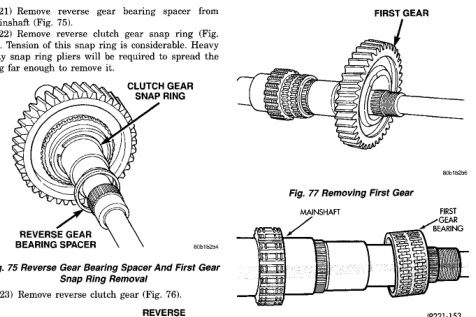
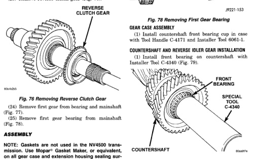

## DISASSEMBLY AND ASSEMBLY (Continued)

(21) Remove reverse gear bearing spacer from mainshaft (Fig. 75).

(22) Remove reverse clutch gear snap ring (Fig. 75). Tension of this snap ring is considerable. Heavy duty snap ring pliers will be required to spread the ring far enough to remove it.

*Fig. 75 Reverse Gear Bearing Spacer And First Gear Snap Ring Removal]*
- CLUTCH GEAR SNAP RING
- REVERSE GEAR
- REVERSE GEAR BEARING SPACER

(23) Remove reverse clutch gear (Fig. 76).

*Fig. 76 Removing Reverse Clutch Gear]*
- REVERSE CLUTCH GEAR

(24) Remove first gear from bearing and mainshaft (Fig. 77).

(25) Remove first gear bearing from mainshaft (Fig. 78).

[Figure: Fig. 77 Removing First Gear]
- FIRST GEAR

[Figure: Fig. 78 Removing First Gear Bearing]
- MAINSHAFT
- FIRST GEAR BEARING

### ASSEMBLY

**NOTE: Gaskets are not used in the NV4500 transmission. Use Mopar® Gasket Maker, or equivalent, on all gear case and extension housing sealing surfaces.**

#### GEAR CASE ASSEMBLY

(1) Install countershaft front bearing cup in case with Tool Handle C-4171 and Installer Tool 6061-1.

#### COUNTERSHAFT FRONT BEARING INSTALLATION

(1) Install front bearing on countershaft with Installer Tool C-4346 (Fig. 79).

[Figure: Fig. 79 Countershaft Front Bearing Installation]
- FRONT BEARING
- SPECIAL TOOL C-4346
- COUNTERSHAFT