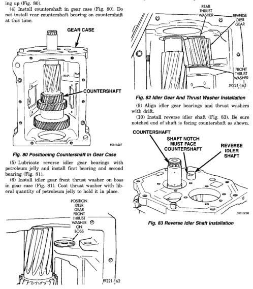

*Fig. 80*

(2) Lubricate countershaft front bearing cup and cone with petroleum jelly. (3) Position gear case on end with rear of case facing up (Fig. 80). (4) Install countershaft in gear case (Fig. 80). Do not install rear countershaft bearing on countershaft at this time.

*Fig. 81 Positioning Idler Gear Front Thrust Washer In Case*

(7) Install reverse idler gear in case (Fig. 82). (8) Install idler gear rear thrust washer between idler gear and case boss (Fig. 82).

*Fig. 83 Reverse Idler Shaft Installation*
