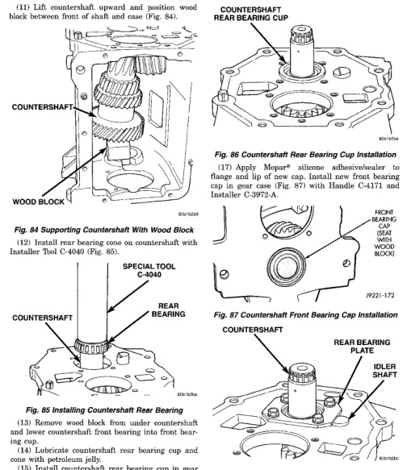

*Fig. 84*

(11) Lift countershaft upward and position wood block between front of shaft and case (Fig. 84),

(13) Remove wood block from under countershaft and lower countershaft front bearing into front bearing cup. (14) Lubricate countershaft rear bearing cup and cone with petroleum jelly. (15) Install countershaft rear bearing cup in gear case and over rear bearing (Fig. 86). Tap cup into place with plastic mallet if necessary. (16) Install countershaft rear bearing plate (Fig. 88). Be sure plate is seated in notch in reverse idler shaft before tightening bearing plate bolts.

*Fig. 87 Countershaft Front Bearing Cap Installation*

*Fig. 88 Countershaft Rear Bearing Plate Installation*
