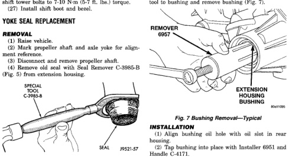
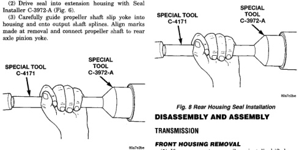

*Fig. 6*

00000

(26) Install shift tower and lever assembly. Tighten shift tower bolts to 7-10 N.m (5-7 ft. lbs.) torque. (27) Install shift boot and bezel.

(1) Place seal in position on extension housing. (2) Drive seal into extension housing with Seal Installer C-3972-A (Fig. 6). (3) Carefully guide propeller shaft slip yoke into housing and onto output shaft splines. Align marks made at removal and connect propeller shaft to rear axle pinion yoke.

(1) Remove housing yoke seal.

(2) Insert Remover 6957 into rear housing. Tighten tool to bushing and remove bushing (Fig. 7),

(1) Align bushing oil hole with oil slot in rear housing. (2) Tap bushing into place with Installer 6951 and Handle C-4171. (3) Install new oil seal in housing using Seal Installer C-3972-A (Fig. 8).

(1) If necessary, temporarily reinstall shift lever assembly. Shift transmission into Neutral. (2) If lubricant was not drained out of transmission during removal, remove drain plug and drain lubricant into container at this time. (3) Inspect drain plug magnet for debris.

*Fig. 7*
