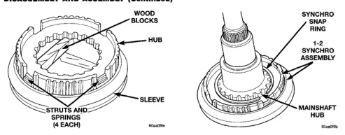
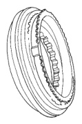
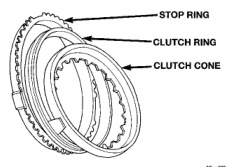

*Fig. 96*

1000

DISASSEMBLY AND ASSEMBLY (Continued)

Fig. 96 Installing 1-2 Synchro Struts And Springs

*Fig. 97*

80aa0184

Fig. 97 Installing First Gear Stop Ring In Synchro Hub

*Fig. 98 1-2 Synchro Installation*

*Fig. 99 Installing 1-2 Synchro Snap Ring*

*Fig. 98*

80aal19c

Fig. 100 Assembling Second Gear Clutch Cone, Clutch Ring, And Stop Ring

*Fig. 101 Second Gear Clutch Cone, Clutch Ring, And Stop Ring Installation*

[Figure]
