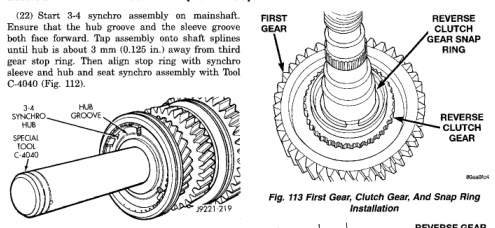
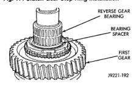
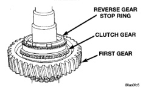

*Fig. 112 Seating 3-4 Synchro Assembly On*

(23) Verify that 3-4 synchro hub is fully seated on shaft. Approximately 3 mm (0.125 in.) of shaft spline should be visible. If hub is not seated, stop ring lugs are misaligned. Rotate ring until lugs are fully engaged in 3-4 hub slots. (24) Verify that second and third gear rotate freely at this point. If not, determine the cause and correct. (25) Invert mainshaft in case or bench. Reverse gear components are easier to install with shaft upright. (26) Install first gear bearing on mainshaft. (27) Install first gear on shaft (Fig. 113). Clutch hub side of gear faces front of shaft. Be sure tabs on clutch ring are aligned and seated in first gear hub. 1-2 synchro hub will not seat properly if clutch ring tabs are misaligned. (28) Install reverse clutch gear on first gear (Fig. 113). Be sure clutch gear is seated on shaft splines. (29) Install reverse clutch gear snap ring (Fig. 113). Use heavy duty snap ring pliers to install this snap ring as ring tension is considerable. Do not overspread snap ring and make sure it is fully seated in groove. Reverse gear will not fit properly if snap ring is not fully seated. (30) Install stop ring on clutch cone (Fig. 114). Be sure stop ring is fully seated on cone taper. (31) Install reverse gear bearing spacer on mainshaft (Fig. 115). Bearing spacer seats against reverse clutch gear snap ring. (32) Install reverse gear bearing on mainshaft (Fig. 115).

CAUTION: The reverse sleeve will fit cither way on the hub. This means the sleeve can be installed backwards if care is not exercised. Be sure the

*Fig. 113 First Gear, Clutch Gear, And Snap Ring*

*Fig. 114 Clutch Gear Stop Ring Installation*

*Fig. 113 Reverse Gear Bearing And Spacer Installation*

tapered side of the sleeve faces rearward after installation.

(33) If reverse gear sleeve and struts were disassembled for service, reassemble sleeve, struts and springs as follows: (a) Position sleeve on hub so tapered side of sleeve faces rearward. Sleeve will fit either way
