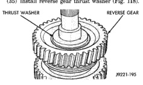
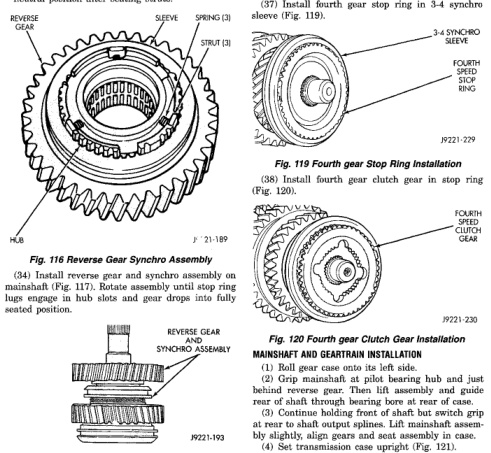

but will cause shift problems if installed backwards (Fig. 116). (b) Rotate sleeve to align teeth on sleeve and hub. Sleeve will slide easily into place on hub when properly aligned. (c) Install springs in gear hub (Fig. 116). Use petroleum jelly to hold springs in place if desired. (d) Compress first spring with flat blade screwdriver and slide strut into position in hub slot. Then work spring into seat in strut with small hooked tool, or screwdriver. (e) Install second and third struts in same manner as described in step (d). (f) Work sleeve upward on hub until struts are centered and seated in sleeve should be in neutral position after seating struts.

*Fig. 117 Reverse Gear Installation*

(35) Install reverse gear thrust washer (Fig. 118).

*Fig. 116*

(36) Install rear bearing on mainshaft. (37) Install fourth gear stop ring in 3-4 synchro sleeve (Fig. 119).

*Fig. 117*
