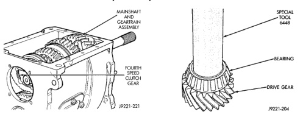
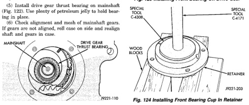
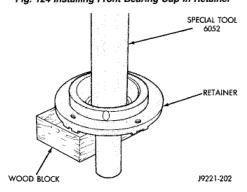

*Fig. 123*

(1) Install bearing on drive gear with Installer Tool 6448 (Fig. 123). (2) Lubricate pilot bearing with petroleum jelly and install it in drive gear bore. (3) Install drive gear on mainshaft. Work gear rearward until mainshaft hub is fully seated in pilot bearing. (4) Install bearing cup in front retainer with Driver Handle C-4171 and Installer C-4308 (Fig. 124). (5) Install new oil seal in front bearing retainer with Tool 6052 (Fig. 125). Use one or two wood blocks to support retainer as shown. Lubricate seal lip with petroleum jelly after installation. (6) Clean contact surfaces of gear case and front bearing retainer with a wax and grease remover. (7) Apply Mopar® Gasket Maker to flange surface of front bearing retainer (Fig. 126).

*Fig. 123 Installing Front Bearing On Drive Gear*

*Fig. 124 Installing Front Bearing Cup In Retainer*

*Fig. 124*

(8) Install front bearing retainer over drive gear and start it into case.

*Fig. 125*
