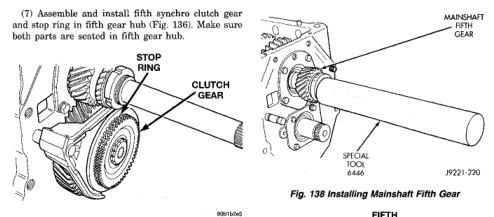
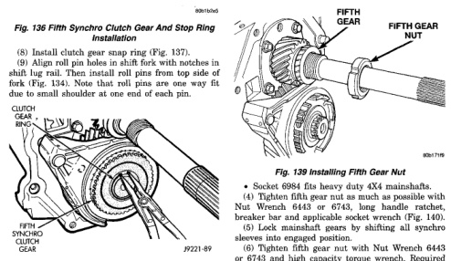

*Fig. 138*

(1) Install mainshaft fifth gear. Use Installer Tool 6446 to seat gear on shaft (Fig. 138). Gear is seated when it contacts rear bearing. (2) Install new fifth gear nut on mainshaft (Fig. 139). (3) There are four splined sockets available to retain the mainshaft while installing the fifth gear nut.

• · Socket 6441 fits light duty 4X2 mainshafts. · Socket 6442 fits light duty 4X4 mainshafts. · Socket 6993 fits heavy duty 4X2 mainshafts.

*Fig. 138 Installing Mainshaft Fifth Gear*

· Socket 6984 fits heavy duty 4X4 mainshafts. (4) Tighten fifth gear nut as much as possible with Nut Wrench 6443 or 6743, long handle ratchet, breaker bar and applicable socket wrench (Fig. 140). (5) Lock mainshaft gears by shifting all synchro sleoves into engaged position. (6) Tighten fifth gear nut with Nut Wrench 6443 or 6743 and high capacity torque wrench. Required torque on nut is 339-475 N-m (250-350 ft. Ibs.). Have helper hold transmission steady if necessary. (7) Use Staking Tool 8213 to stake the fifth gear nut to the mainshaft. The tool is designed to function on both the light duty and heavy duty versions of the NV4500. Ensure that the tool is configured properly for the transmission being serviced.

NOTE: It may be necessary to remove the fifth gear fork and countershaft fifth gear components in order to instali the Staking Tool 8213 onto the fifth gear nut.

*Fig. 139*
