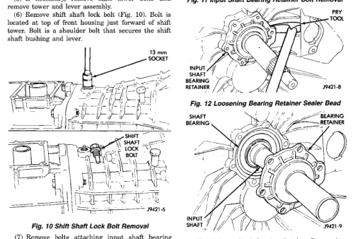

*Fig. 11*

(5) If necessary, remove shift tower bolts and remove tower and lever assembly. (6) Remove shift shaft lock bolt (Fig. 10). Bolt is located at top of front housing just forward of shift tower. Bolt is a shoulder bolt that secures the shift shaft bushing and lever.

(7) Remove bolts attaching input shaft bearing retainer in front housing (Fig. 11). Note location of oil feed formation on retainer for installation reference. (8) Remove input shaft bearing retainer. Use prv tool to carefully lift retainer and break sealer bead (Fig. 12). (9) Remove bearing retainer from input shaft (Fig. 13).

Fig. 11 Input Shaft Bearing Retainer Bolt Removal

*Fig. 12 Loosening Bearing Retainer Sealer Bead*

*Fig. 13 Input Shaft Bearing Retainer Removal*

[Figure]
