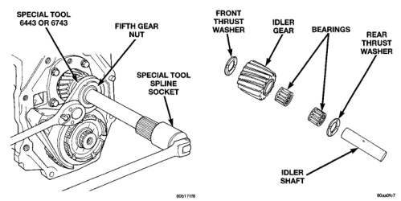
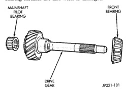

*Fig. 141*

Inspect the cover and shift components whenever the cover is removed from the gear case or whenever diagnosis indicates inspection is necessary. Check the forks for wear, distortion, cracks, or being loose on the shift rails. Also check fit of the shift rails in the cover. Replace the cover assembly if the rails are loose in the cover bores. Inspect and replace the pads on the fifth-reverse shift fork if worn. The expansion plugs at the rear of the cover can be replaced if loose or leaking. A gasket is not used between the shift cover and gear case. Use Mopar® Gasket Maker, or equivalent, to seal the cover.

Clean the gears, bearings shafts, extension/adapter housing and gear case with solvent. Dry all parts except the bearings with compressed air. Allow the bearings to either air dry or wipe them dry with clean shop towels. Inspect the reverse idler gear, bearings, shaft and thrust washers (Fig. 141). Replace the bearings if the rollers are worn, chipped, cracked, flat-spotted, or brinnelled. Or if the bearing cage is damaged or distorted. Replace the thrust washers if cracked. chipped, or worn. Replace the gear if the teeth are chipned, cracked or worn thin. Inspect the drive gear and bearings (Fig. 142). Minor scratches and burrs on the gear surfaces can be reduced with an oil stone and 400 grit paper wetted with oil. Replace either bearing if worn, or damaged. Replace the gear if any teeth, splines, or bearing surfaces are also worn or damaged.

*Fig. 142*

Inspect the front bearing retainer and bearing cup (Fig. 143). Replace the bearing cup if scored, cracked, brinnelled, or rough. Check the release bearing slide surface of the retainer carefully. Minor corrosion, nicks, or pitting can be smoothed with 400 grit emery and polished out with crocus cloth. Wet the abrasive paper and crocus cloth with oil when smoothing/polishing. Replace the retainer if worn or damaged in any way. Do not reuse the original retainer bolts. Install new bolts during assembly. Inspect the countershaft and bearings (Fig. 144). Replace the bearings if worn, rough, flat spotted, or
