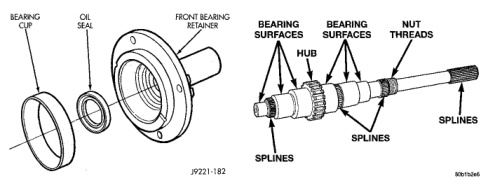
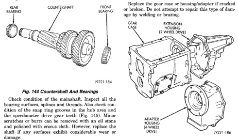

*Fig. 145*

0000

heat checked. Check the countershaft gear teeth carefully. Small nicks, scratches, or burrs can be removed with an oil stone and 400 grit paper wetted with oil. Replace the shaft if any of the teeth are worn, cracked, broken, or severely chipped. Be sure to check condition of the countershaft bearing cups. Replace either bearings cup if worn, or damaged.

Check condition of the mainshaft. Inspect all the bearing surfaces, splines and threads. Also check condition of the snap ring grooves in the hub area and the speedometer drive gear teeth (Fig. 145). Minor scratches or burrs can be removed with an oil stone and polished with crocus cloth. However, replace the shaft if any surfaces exhibit considerable wear or damage. Check condition of the gear case and extension or adapter housing. Be sure the alignment dowels in the case top surface and in the housing/adapter are tight and in good condition. Run a tap through the gear case bolt holes if the threads need minor cleanup. Helicoil inserts can be

used to repair seriously damaged threaded holes if necessary.

Be sure all case and housing/adapter sealing and mating surfaces are free of burrs and nicks. This is especially important as gaskets are not used in the NV4500. Minor nicks and scratches on the sealing surfaces can be dressed off with a fine tooth file or oil stone. Replace the gear case or housing/adapter if cracked or broken. Do not attempt to repair this type of damage by welding or brazing.

Check condition of the countershaft fifth gear components (Fig. 147). This includes the shift lug and rail located in the gear case and the rail bushings.

*Fig. 147*
