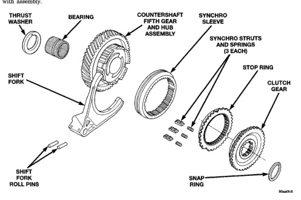

Inspect the gear and hub assembly. Minor burrs can be cleaned up with an oil stone. However, the gear and hub assembly should be replaced if the teeth or splines are excessively worn, or damaged. The synchro sleeve should also be replaced if worn or damaged in any way. Do not reuse synchro struts that are worn, or springs that are collapsed or severely distorted. Replace worn distorted synchro parts to avoid shift problems after assembly and installation. The shift fork should be inspected for evidence of wear and distortion. Check fit of the sleeve in the fork to be sure the two parts fit and work smoothly. Replace the fork if the roll pin holes are worn oversize or damaged. Do not attempt to salvage a worn fork. It will cause shift problems later on. Replace the shift fork roll pins if necessary, or if doubt exists about their condition. The bearings should be examined carefully for wear, roughness, flat spots, pitting, or other damage. Replace the bearings if necessary. Inspect the stop ring and clutch gear. replace either part if worn or damaged in any way. Also be sure replacement parts fit properly before proceeding with assembly.

Examine the 1-2 synchro hub and sleeve for wear or damage. Replace the sleeve and hub if the splines are worn, chipped or damaged. Replace the synchro struts if worn, or chipped. Also replace the springs if collapsed, distorted, or broken. Inspect the mainshaft geartrain components. Check the teeth on all gears, hubs, clutch gears, stop rings and clutch rings. The teeth must be in good condition and not worn, cracked, or chipped. Replace any component that exhibits wear or damage. Examine the synchro stop rings, clutch rings and clutch gears. Replace any part that exhibits wear, distortion, or damage. Replace the clutch rings if the friction material is burned, flaking off, or worn. Inspect all of the thrust washers and locating pins. Replace the pins if bent, or worn. Replace the washers if worn, or the locating pin notches are distorted. Check condition of the synchro struts and springs. Replace these parts if worn, cracked, or distorted.

*Fig. 147 Countershaft Fifth Gear Components*
