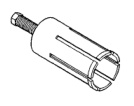
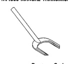

# SPECIFICATIONS

## TORQUE

| DESCRIPTION | TORQUE |
|-------------|--------|
| Backup Light Switch | 22-34 N·m (193-300 in. lbs.) |
| Countershaft Bearing Plate Bolts | 19-26 N·m (170-230 in. lbs.) |
| Fifth Gear Nut | 339-475 N·m (250-350 ft. lbs.) |
| Drain and Fill Plugs | 34-47 N·m (25-35 ft. lbs.) |
| Front Bearing Retainer Bolts | 27-34 N·m (235-305 in. lbs.) |
| Mainshaft Bearing Plate Bolts | 19-26 N·m (170-230 in. lbs.) |
| PTO Cover Bolts | 27-54 N·m (20-40 ft. lbs.) |
| Extension/Adapter Housing Bolts | 41-68 N·m (30-50 ft. lbs.) |
| Reverse Inhibitor Screws | 8-14 N·m (75-115 in. lbs.) |
| Shift Cover Bolts | 27-31 N·m (21-27 ft. lbs.) |

J9221-12

## SPECIAL TOOLS

### NV4500 MANUAL TRANSMISSION

*Fig. 2 Remover, Seal—C-3985-B*

*Fig. 3 Remover, Bushing—6957*

[Figure: Remover, Bushing—8155]

[Figure: Installer, Bushing—6951]

[Figure: Installer, Bushing—8156]