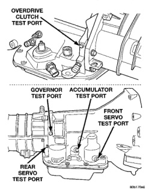

*Fig. 1*

· Line pressure at accumulator port should be 54-60 psi (372-414 kPa) with throttle lever forward and gradually increase to 90-96 psi (621-662 kPa) as throttle lever is moved rearward. · Rear servo pressure should be same as line pressure within 3 psi (20.68 kPa).

Test Two-Transmission In 2 Range

NOTE: This test checks pump output, line pressure and pressure regulation. Use 100 psi Test Gauge C-3292 for this test.

(1) Leave vehicle in place on hoist and leave Test Gauge C-3292 connected to accumulator port. (2) Have helper start and run engine at 1000 rpm. (3) Move transmission shift lever one detent rearward from full forward position. This is 2 range, (4) Move transmission throttle lever from full forward to full rearward position and read pressure on gauge. (5) Line pressure should be 54-60 psi (372-414 kPa) with throttle lever forward and gradually increase to 90-96 psi (621-662 kPa) as lever is moved rearward.

NOTE: This test checks pressure requlation and condition of the clutch circuits. Both test gauges are required for this test.

(1) Turn OD switch off. (2) Leave vehicle on hoist and leave Gauge C-3292 in place at accumulator port. (3) Move Gauge C-3293-SP over to front servo port for this test. (4) Have helper start and run engine at 1600 rpm for this test. (5) Move transmission shift lever two detents rearward from full forward position. This is D range. (6) Read pressures on both gauges as transmission throttle lever is gradually moved from full forward to full rearward position: · Line pressure at accumulator in D range third gear, should be 54-60 psi (372-414 kPa) with throttle lever forward and increase as lever is moved rearward.

· Front servo pressure in D range third gear. should be within 3 psi (21 kPa) of line pressure up to kickdown point.

NOTE: This test checks pump output, pressure regulation and the front clutch and rear servo circuits. Use 300 psi Test Gauge C-3293-SP for this test.

(1) Leave vehicle on hoist and leave gauge C3292 in place at accumulator port. (2) Move 300 psi Gauge C-3293-SP back to rear servo port. (3) Have helper start and run engine at 1600 rpm for test. (4) Move transmission shift lever four detents rearward from full forward position. This is Reverse range. (5) Move transmission throttle lever fully forward then fully rearward and note reading at Gauge C-3293-SP. (6) Pressure should be 145 - 175 psi (1000-1207 kPa) with throttle lever forward and increase to 230 - 280 psi (1586-1931 kPa) as lever is gradually moved rearward.
