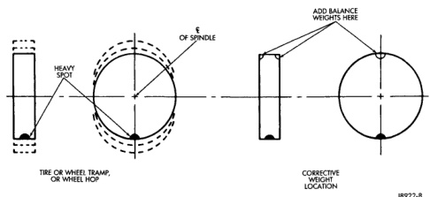

# SERVICE PROCEDURES (Continued)

*Fig. 8 Oil Location]*

- Tighten the wheel lug nuts in the numbered sequential pattern until they are snug tight. Then tighten lug nut to specified torque following same number sequence (Fig. 8).

- Tighten lug nuts in same numbered sequence a second time to the specified torque. This will ensure that the wheels are thoroughly mated.

- Check lug nut specified torque after 100 miles (160 kilometers). Also after 500 miles (800 kilometers) of vehicle operation.

**NOTE: Wheel lug nuts should be tightened to specified torque at every maintenance interval thereafter.**

## TIRE AND WHEEL BALANCE

It is recommended that a two plane service dynamic balancer be used when a tire and wheel assembly require balancing. Refer to balancer operation instructions for proper cone mounting procedures. Typically use front cone mounting method for steel wheels. For aluminum wheel use back cone mounting method without cone spring.

**NOTE: Static should be used only when a two plane balancer is not available.**

**NOTE: Cast aluminum and forged aluminum wheels require coated balance weights and special alignment equipment.**

Wheel balancing can be accomplished with either on or off vehicle equipment. When using on-vehicle balancing equipment, remove the opposite wheel/tire. Off-vehicle balancing is recommended.

For static balancing, find location of heavy spot causing the imbalance. Counter balance wheel directly opposite the heavy spot. Determine weight required to counter balance the area of imbalance. Place half of this weight on the **inner** rim flange and the other half on the **outer** rim flange (Fig. 10).

For dynamic balancing, the balancing equipment is designed to locate the amount of weight to be applied to both the inner and outer rim flange (Fig. 11).

[Figure: Fig. 10 Static Unbalance & Balance]

*Fig. 8 Static Unbalance & Balance*

*Source: 22 Tires and Wheels, Page 10*
