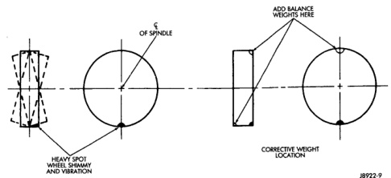

# SERVICE PROCEDURES (Continued)

*Fig. 11 Dynamic Unbalance & Balance]*

*Fig. 11 Dynamic Unbalance & Balance*

---

# SPECIFICATIONS

## TORQUE CHART

| DESCRIPTION | TORQUE |
|-------------|--------|
| **Lug Nut** | |
| BR1500 (5 Stud Wheel) | 130 N-m (95 ft. lbs.) |
| BR2500 (8 Stud Wheel) | 180 N-m (135 ft. lbs.) |
| BR3500 (8 Stud Dual Wheel) | 195 N-m (145 ft. lbs.) |

*Source: 22 Tires and Wheels, Page 11*
