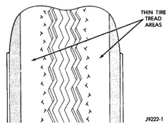
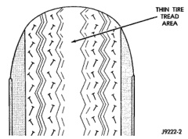

# DESCRIPTION AND OPERATION (Continued)

*Fig. 1 Tire Identification]*

*Fig. 1 Tire Identification*

**METRIC TIRE SIZES**

P 205 / 75 R 15

| Code | Description |
|------|-------------|
| TIRE TYPE | |
| P - PASSENGER | |
| T - TEMPORARY | |
| C - COMMERCIAL | |
| LT - LIGHT TRUCK | |
| SECTION WIDTH (MILLIMETERS) | |
| 185 | |
| 195 | |
| 205 | |
| ETC. | |
| ASPECT RATIO (SECTION HEIGHT) (SECTION WIDTH) | |
| 70 | |
| 75 | |
| 80 | |
| CONSTRUCTION TYPE | |
| R - RADIAL | |
| B - BIAS + BELTED | |
| D - DIAGONAL (BIAS) | |
| RIM DIAMETER (INCHES) | |
| 14 | |
| 15 | |
| 16 | |

## RADIAL-PLY TIRES

Radial-ply tires improve handling, tread life and ride quality, and decrease rolling resistance.

Radial-ply tires must always be used in sets of four. Under no circumstances should they be used on the front only. They may be mixed with temporary spare tires when necessary. A maximum speed of 50 MPH is recommended while a temporary spare is in use.

Radial-ply tires have the same load-carrying capacity as other types of tires of the same size. They also use the same recommended inflation pressures.

The use of oversized tires, either in the front or rear of the vehicle, can cause vehicle drive train failure. This could also cause inaccurate wheel speed signals when the vehicle is equipped with Anti-Lock Brakes.

The use of tires from different manufacturers on the same vehicle is NOT recommended. The proper tire pressure should be maintained on all four tires. For proper tire pressure refer to the Tire Inflation Pressure Chart provided with the vehicle.

## SPARE TIRE-TEMPORARY

The temporary spare tire is designed for emergency use only. The original tire should be repaired or replaced at the first opportunity and reinstall. Do not exceed speeds of 50 MPH. Refer to Owner's Manual for complete details.

## TIRE INFLATION PRESSURES

**CAUTION: Models 2500 and 3500 now use a high pressure snap-in tire valve. Do not substitute with other tire valves. The Tire and Rim industry designations are TR413 for low pressure and 600HP for high pressure.**

Under inflation (Fig. 2) causes rapid shoulder wear and tire flexing.

*Fig. 2 Under Inflation Wear]*

*Fig. 2 Under Inflation Wear*

Over inflation (Fig. 3) causes rapid center wear and loss of the tire's ability to cushion shocks.

[Figure: Fig. 3 Over Inflation Wear]

Improper inflation can cause:

- Uneven wear patterns
- Reduced tread life
- Reduced fuel economy
- Unsatisfactory ride
- Cause the vehicle to drift

*Source: 22 Tires and Wheels, Page 2*
