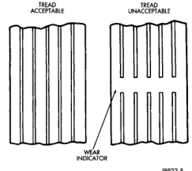

# DESCRIPTION AND OPERATION (Continued)

Refer to the Tire Inflation Pressure brochure for information regarding proper tire inflation. This information is provided with the Owner's Manual.

This pressure has been carefully selected to provide for safe vehicle operation. Tire pressure should be checked **cold** once a month. Tire pressure decreases when the outside temperature drops.

Inflation pressures specified on the placards are always cold inflation pressure. Cold inflation pressure is obtained after the vehicle has not been operated for at least 3 hours. Tire inflation pressures may increase from 2 to 6 pounds per square inch (psi) during operation. **Do not** reduce this normal pressure build-up.

Vehicles loaded to the maximum capacity should not be driven at continuous speeds above 75 mph (120 km/h).

**WARNING: OVER OR UNDER INFLATED TIRES CAN AFFECT VEHICLE HANDLING AND MAY RESULT IN LOSS OF VEHICLE CONTROL.**

## TIRE PRESSURE FOR HIGH SPEED OPERATION

Chrysler Corporation advocates driving at safe speeds within posted speed limits. Where speed limits allow the vehicle to be driven at high speeds, correct tire inflation pressure is very important. For speeds up to and including 120 km/h (75 mph), tires must be inflated to the pressures shown on the tire placard. For continuous speeds in excess of 120 km/h (75 mph), tires must be inflated to the maximum pressure specified on the tire sidewall.

Vehicles loaded to the maximum capacity should not be driven at continuous speeds above 75 mph (120 km/h).

For emergency vehicles that are driven at speeds over 90 mph (144 km/h), special high speed tires must be used. Consult tire manufacturer for correct inflation pressure recommendations.

## REPLACEMENT TIRES

The original equipment tires provide a proper balance of many characteristics such as:

- Ride
- Noise
- Handling
- Durability
- Tread life
- Traction
- Rolling resistance
- Speed capability

It is recommended that tires equivalent to the original equipment tires be used when replacement is needed.

Failure to use equivalent replacement tires may adversely affect the safety and handling of the vehicle.

The use of oversize tires not listed in the specification charts may cause interference with vehicle components. Under extremes of suspension and steering travel, interference with vehicle components may cause tire damage.

**WARNING: FAILURE TO EQUIP THE VEHICLE WITH TIRES HAVING ADEQUATE SPEED CAPABILITY CAN RESULT IN SUDDEN TIRE FAILURE.**

---

# DIAGNOSIS AND TESTING

## PRESSURE GAUGES

A quality air pressure gauge is recommended to check tire pressure. After checking the air pressure, replace valve cap finger tight.

## TREAD WEAR INDICATORS

Tread wear indicators are molded into the bottom of the tread grooves. When tread depth is 1.6 mm (1/16 in.), the tread wear indicators will appear as a 13 mm (1/2 in.) band (Fig. 4).

Tire replacement is necessary when indicators appear in two or more grooves or if localized balding occurs.

*Fig. 4 Tread Wear Indicators]*

*Fig. 4 Tread Wear Indicators*

## TIRE WEAR PATTERNS

Under inflation will cause wear on the shoulders of tire. Over inflation will cause wear at the center of tire.

*Source: 22 Tires and Wheels, Page 3*
