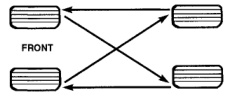
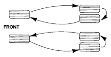

# DIAGNOSIS AND TESTING (Continued)

*Fig. 5 Tire Wear Patterns]*

*Fig. 5 Tire Wear Patterns*

| CONDITION | RAPID WEAR AT SHOULDERS | RAPID WEAR AT CENTER | CRACKED TREADS | WEAR ON ONE SIDE | FEATHERED EDGE | BALD SPOTS | SCALLOPED WEAR |
|-----------|------------------------|---------------------|----------------|------------------|----------------|------------|----------------|
| EFFECT | | | | | | | |
| CAUSE | UNDER-INFLATION OR LACK OF ROTATION | OVER-INFLATION OR EXCESSIVE SPEED* | UNDER-INFLATION | EXCESSIVE CAMBER | INCORRECT TOE | UNBALANCED WHEELS | LACK OF ROTATION OR WORN OR OUT-OF-ALIGNMENT SUSPENSION, TIRE DEFECT |
| CORRECTION | ADJUST PRESSURE TO SPECIFICATIONS WHEN TIRES ARE COOL, ROTATE TIRES | ADJUST PRESSURE TO SPECIFICATIONS | ADJUST CAMBER TO SPECIFICATIONS | ADJUST TOE-IN TO SPECIFICATIONS, SEE GROUP 2 | DYNAMIC OR STATIC BALANCE WHEELS | ROTATE TIRES AND INSPECT SUSPENSION |

*HAVE TIRE INSPECTED FOR FURTHER USE

Excessive camber causes the tire to run at an angle to the road. One side of tread is then worn more than the other (Fig. 5).

Excessive toe-in or toe-out causes wear on the tread edges and a feathered effect across the tread (Fig. 5).

## TIRE NOISE OR VIBRATION

Radial-ply tires are sensitive to force impulses caused by improper mounting, vibration, wheel defects, or possibly tire imbalance.

To find out if tires are causing the noise or vibration, drive the vehicle over a smooth road at varying speeds. Note the noise level during acceleration and deceleration. The engine, differential and exhaust noises will change as speed varies, while the tire noise will usually remain constant.

---

# SERVICE PROCEDURES

## ROTATION

Tires on the front and rear axles operate at different loads and perform different steering, driving, and braking functions. For these reasons, the tires wear at unequal rates. They may also develop irregular wear patterns. These effects can be reduced by rotating the tires according to the maintenance schedule in the Owners Manual. This will improve tread life, traction and maintain a smooth quiet ride.

The recommended method of tire rotation is (Fig. 6). Other methods can be used, but may not provide the same tire longevity benefits.

Dual wheel vehicles require a different tire rotation pattern. Refer to (Fig. 7) for the proper tire rotation with dual wheels.

*Fig. 6 Tire Rotation Pattern]*

*Fig. 6 Tire Rotation Pattern*

[Figure: Fig. 7 Dual Wheel Tire Rotation Pattern]

*Source: 22 Tires and Wheels, Page 4*
