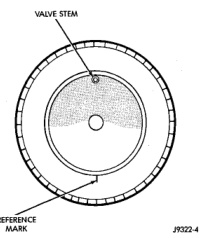
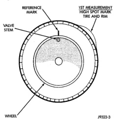
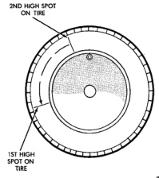

# SERVICE PROCEDURES (Continued)

## MATCH MOUNTING

Wheels and tires are match mounted at the factory. This means that the high spot of the tire is matched to the low spot on the wheel rim. Each are marked with a bright colored temporary label on the outboard surface for alignment. The wheel is also marked permanently on the inside of the rim in the tire well. This permanent mark may be a paint dot or line, a permanent label or a stamped impression such as an X. An optional location mark is a small spherical indentation on the vertical face of the outboard flange on some non styled base steel wheels. The tire must be removed to locate the permanent mark on the inside of the wheel.

Before dismounting a tire from its wheel, a reference mark should be placed on the tire at the valve stem location. This reference will ensure that it is remounted in the original position on the wheel.

(1) Remove the tire and wheel assembly from the vehicle and mount on a service dynamic balance machine.

(2) Measure the total runout on the center of the tire tread rib with a dial indicator. Record the indicator reading. Mark the tire to indicate the high spot. Place a mark on the tire at the valve stem location (Fig. 8).

*Fig. 8 First Measurement On Tire]*

*Fig. 8 First Measurement On Tire*

(3) Break down the tire and remount it 180 degrees on the rim (Fig. 9).

(4) Measure the total indicator runout again. Mark the tire to indicate the high spot.

(5) If runout is still excessive, the following procedures must be done.

*Fig. 9 Remount Tire 180 Degrees]*

*Fig. 9 Remount Tire 180 Degrees*

- If the high spot is within 101.6 mm (4.0 in.) of the first spot and is still excessive, replace the tire.

- If the high spot is within 101.6 mm (4.0 in.) of the first spot on the wheel, the wheel may be out of specifications. Refer to Wheel and Tire Runout.

- If the high spot is NOT within 101.6 mm (4.0 in.) of either high spot, draw an arrow on the tread from second high spot to first. Break down the tire and remount it 90 degrees on rim in that direction (Fig. 10). This procedure will normally reduce the runout to an acceptable amount.

*Fig. 10 Remount Tire 90 Degrees In Direction of Arrow]*

*Fig. 10 Remount Tire 90 Degrees In Direction of Arrow*

*Source: 22 Tires and Wheels, Page 5*
