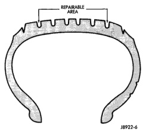

# SERVICE PROCEDURES (Continued)

## REPAIRING LEAKS

For proper repairing, a radial tire must be removed from the wheel. Repairs should only be made if the defect, or puncture, is in the tread area (Fig. 11). The tire should be replaced if the puncture is located in the sidewall.

Deflate tire completely before removing the tire from the wheel. Use lubrication such as a mild soap solution when dismounting or mounting tire. Use tools free of burrs or sharp edges which could damage the tire or wheel rim.

Before mounting tire on wheel, make sure all rust is removed from the rim bead and repaint if necessary.

Install wheel on vehicle, and tighten to proper torque specification.

*Fig. 11 Tire Repair Area]*

*Fig. 11 Tire Repair Area*

---

# CLEANING AND INSPECTION

## CLEANING TIRES

Remove protective coating on tires before delivery of vehicle. This coating may cause deterioration of tires.

To remove the protective coating applying warm water and let it soak for a few minutes. Then scrub the coating away with a soft bristle brush. Steam cleaning may also be used to remove the coating.

**NOTE: DO NOT use gasoline, mineral oil, oil-based solvent or wire brush for cleaning.**

---

# SPECIFICATIONS

## TIRE REVOLUTIONS PER MILE

| TIRE SIZE | SUPPLIER | REVOLUTIONS PER MILE |
|-----------|----------|---------------------|
| P225/75/R16 XL | GOODYEAR | 716 rpm |
| P245/75R16 | GOODYEAR | 689 rpm |
| P245/75R16 | MICHELIN | 691 rpm |
| P265/75R16 | GOODYEAR | 660 rpm |
| P275/60R17 | GOODYEAR | 693 rpm |
| LT245/75R16 E | GOODYEAR | 683 rpm |
| LT245/75R16 E | MICHELIN | 678 rpm |
| LT215/85R16 E | MICHELIN | 687 rpm |
| LT215/85R16 E M/S | MICHELIN | 683 rpm |

*Source: 22 Tires and Wheels, Page 6*
