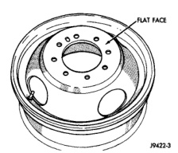
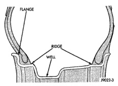
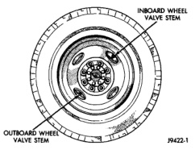

# WHEELS

## INDEX

### DESCRIPTION AND OPERATION

| Topic | Page |
|-------|------|
| Wheels Information | 7 |

### DIAGNOSIS AND TESTING

| Topic | Page |
|-------|------|
| Tire and Wheel Runout | 8 |
| Wheel Inspection | 8 |

### SERVICE PROCEDURES

| Topic | Page |
|-------|------|
| Tire and Wheel Balance | 10 |
| Wheel Installation | 9 |

### SPECIFICATIONS

| Topic | Page |
|-------|------|
| Torque Chart | 11 |

---

# DESCRIPTION AND OPERATION

## WHEELS INFORMATION

Original equipment wheels are designed for the specified Maximum Vehicle Capacity.

All models use steel or cast aluminum drop center wheels. The safety rim wheel (Fig. 1) has raised sections between the rim flanges and the rim well.

Initial inflation of the tire forces the bead over these raised sections. In case of tire failure, the raised sections hold the tire in position on the wheel until the vehicle can be brought to a safe stop.

Cast aluminum wheels require special balance weights and alignment equipment.

Ram Truck Models equipped with dual rear wheels have eight-stud hole rear wheels. The wheels have a flat mounting surface (Fig. 2). The slots in the wheel must be aligned to provide access to the valve stem (Fig. 3).

*Fig. 1 Safety Rim]*

*Fig. 1 Safety Rim*

*Fig. 2 Flat Face Wheel]*

*Fig. 2 Flat Face Wheel*

*Fig. 3 Dual Rear Wheels]*

*Fig. 3 Dual Rear Wheels*

*Source: 22 Tires and Wheels, Page 7*
