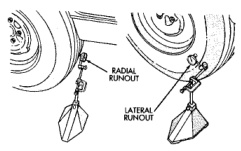
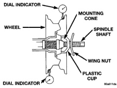

# DIAGNOSIS AND TESTING

## WHEEL INSPECTION

Inspect wheels for:

- Excessive run out
- Dents or cracks
- Damaged wheel lug nut holes
- Air Leaks from any area or surface of the rim

If a wheel is damaged an original equipment replacement wheel should be used. When obtaining replacement wheels, they should be equivalent in load carrying capacity. The diameter, width, offset, pilot hole and bolt circle of the wheel should be the same as the original wheel.

**NOTE: Do not attempt to repair a wheel by hammering, heating or welding.**

**WARNING: FAILURE TO USE EQUIVALENT REPLACEMENT WHEELS MAY ADVERSELY AFFECT THE SAFETY AND HANDLING OF THE VEHICLE. USED WHEELS ARE NOT RECOMMENDED. THE SERVICE HISTORY OF THE WHEEL MAY HAVE INCLUDED SEVERE TREATMENT OR VERY HIGH MILEAGE. THE RIM COULD FAIL WITHOUT WARNING.**

## TIRE AND WHEEL RUNOUT

Radial runout is the difference between the high and low points on the tire or wheel (Fig. 4).

Lateral runout is the **wobble** of the tire or wheel.

*Fig. 4 Checking Tire/Wheel/Hub Runout]*

*Fig. 4 Checking Tire/Wheel/Hub Runout*

Radial runout of more than 1.5 mm (.060 inch) measured at the center line of the tread may cause the vehicle to shake.

Lateral runout of more than 2.0 mm (.080 inch) measured near the shoulder of the tire may cause the vehicle to shake.

Sometimes radial runout can be reduced. Relocate the wheel and tire assembly on the mounting studs (See Method 1). If this does not reduce runout to an acceptable level, the tire can be rotated on the wheel. (See Method 2).

### METHOD 1 (RELOCATE WHEEL ON HUB)

(1) Drive vehicle a short distance to eliminate tire flat spotting from a parked position.

(2) Check wheel bearings and adjust if adjustable or replace if necessary.

(3) Check the wheel mounting surface.

(4) Relocate wheel on the mounting, two studs over from the original position.

(5) Tighten wheel nuts until all are properly torqued, to eliminate brake distortion.

(6) Check radial runout. If still excessive, mark tire sidewall, wheel, and stud at point of maximum runout and proceed to Method 2.

### METHOD 2 (RELOCATE TIRE ON WHEEL)

**NOTE: Rotating the tire on wheel is particularly effective when there is runout in both tire and wheel.**

(1) Remove tire from wheel and mount wheel on service dynamic balance machine.

(2) Check wheel radial runout (Fig. 5) and lateral runout (Fig. 6).

- STEEL WHEELS: Radial runout 0.040 in., Lateral runout 0.045 in. (maximum)
- ALUMINUM WHEELS: Radial runout 0.030 in., Lateral runout 0.035 in. (maximum)

(3) If point of greatest wheel lateral runout is near original chalk mark, remount tire 180 degrees. Recheck runout. Refer to match mounting procedure.

*Fig. 5 Radial Runout]*

*Fig. 5 Radial Runout*

*Source: 22 Tires and Wheels, Page 8*
