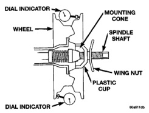
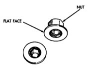

# DIAGNOSIS AND TESTING (Continued)

*Fig. 6 Lateral Runout]*

*Fig. 6 Lateral Runout*

---

# SERVICE PROCEDURES

## WHEEL INSTALLATION

**CAUTION: Models equipped with chrome plated wheels are not supplied with chrome plated lug nuts. Under no circumstances are chrome plated lug nuts to be used, use only the factory specified lug nuts.**

**CAUTION: All 8800 GVW 4x4 vehicles have a factory install spacer behind the right front wheel.**

The wheel studs and nuts are designed for specific applications. Do not use replacement parts of lesser quality or a substitute design.

The 3500 use a two piece flat face nut (Fig. 7).

*Fig. 7 Two Piece Lug Nut]*

*Fig. 7 Two Piece Lug Nut*

All aluminum and some steel wheels have wheel stud nuts which feature an enlarged nose. This enlarged nose is necessary to ensure proper retention of the aluminum wheels.

Before installing the wheel, be sure to remove any build up of corrosion on the wheel mounting surfaces. Ensure wheels are installed with good metal-to-metal contact. Improper installation could cause loosening of wheel nuts. This could affect the safety and handling of your vehicle.

To install the 5 stud wheel, first position it properly on the mounting surface. All wheel nuts should then be tightened just snug. Gradually tighten them in sequence to specified torque (Fig. 8). **Never use oil or grease on studs.**

[Figure: Fig. 8 Lug Nut Tightening Pattern]

### DUAL REAR WHEEL INSTALLATION

Dual rear wheels use a special heavy duty lug nut wrench. It is recommended to remove and install dual rear wheels only when the proper wrench is available. The wrench is also use to remove wheel center caps for more information refer to Owner's Manual.

The tires on both wheels must be completely raised off the ground when tightening the lug nuts. This will ensure correct wheel centering and maximum wheel clamping.

A two piece flat face lug nut with right-hand threads is used for retaining the wheels on the hubs (Fig. 7).

The dual rear wheel lug nuts should be tightened according to the following procedure:

Place two drops of oil to the interface of the nut/washer (Fig. 9) before installing on the wheel stud.

**NOTE: Do not use more than two drops of oil on the nut/washer, since the center caps attach in this area.**

*Source: 22 Tires and Wheels, Page 9*
