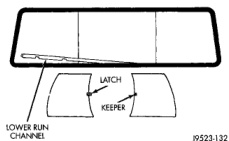
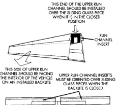

# REMOVAL AND INSTALLATION (Continued)

*Fig. 13 Lower Run Channel Removal]*

### SLIDING BACKLITE LATCH AND KEEPER

#### REMOVAL

(1) Disengage latch and keeper.

(2) Remove latch/keeper screws.

(3) Separate Latch/keeper from glass panel.

#### INSTALLATION

(1) Position Latch/keeper on glass panel.

(2) Install screws. Tighten the screws with 1.5 N-m (15 in. lbs.) torque.

(3) Engage latch and keeper to verify operation.

*Fig. 14 Glass Panel Installation]*

---
*Chapter 23 Body, Page 10*
