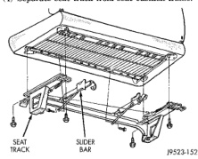
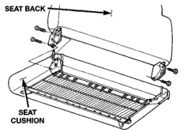

# SEATS

## INDEX

| Section | Page |
|---------|------|
| REMOVAL AND INSTALLATION | |
| Bench Seat Back | 11 |
| Bench Seat Back Cover | 12 |
| Bench Seat Cushion Cover | 12 |
| Bench Seat Track | 11 |
| EZ Entry Seat Track—Club Cab | 15 |
| Front Seat Back—Quad Cab | 15 |
| Front Seat Back Cover—Quad Cab | 17 |
| Front Seat Cushion—Quad Cab | 17 |
| Front Seat Cushion Cover—Quad Cab | 18 |
| Front Seat Recliner—Quad Club | 16 |
| Front Seat Riser—Quad Cab | 14 |
| Front Seat Track Adjuster—Quad Cab | 14 |
| Split Bench Seat Back—Std Cab | 13 |
| Split Bench Seat Back Cover—Std Cab | 13 |
| Split Bench Seat Cushion Cover—Std Cab | 14 |
| Split Bench Seat Track—Std Cab | 12 |

## REMOVAL AND INSTALLATION

### BENCH SEAT TRACK

#### REMOVAL

(1) Remove seat from vehicle.

(2) Remove inboard seat belt buckles.

(3) Remove bolts attaching seat track to seat cushion frame (Fig. 1).

(4) Separate seat track from seat cushion frame.

*Fig. 1 Seat Track Removal]*

#### INSTALLATION

(1) Position seat track on seat cushion frame.

(2) Ensure seat track and slider bar are aligned.

(3) Install rear seat track bolts. Tighten seat track bolts to 25 N-m (18 ft.lbs.) torque.

(4) Install inboard seat belt buckles. Tighten bolts to 40 N-m (30 ft.lbs.) torque.

(5) Pull seat release and move track rearward.

(6) Install front seat track bolts. Tighten seat track bolts to 25 N-m (18 ft.lbs.) torque.

(7) Align slider bars and install bolts. Tighten slider bar bolts to 10.0 N-m (7 ft.lbs.) torque.

(8) Install seat.

### BENCH SEAT BACK

#### REMOVAL

(1) Move seat to the full forward position.

(2) Release J-Strap and peel back side of cover (corner flap) (Fig. 3).

(3) Remove bolts attaching seat back to seat cushion and separate seat back from seat cushion (Fig. 2).

*Fig. 2 Seat Back Removal/Installation]*

#### INSTALLATION

(1) Align seat cushion with seat back.

(2) Install bolts through seat back latch into seat cushion frame. Tighten bolts to 25 N-m (18 ft.lbs.) torque.

(3) Pull side of cover (corner flap) facing rear of the cushion over and secure J-Strap (Fig. 3).

(4) Plastic cover on side cover (corner flap) at rear of cushion must be over the pin on the inertia latches.

---
*Chapter 23 Body, Page 11*
